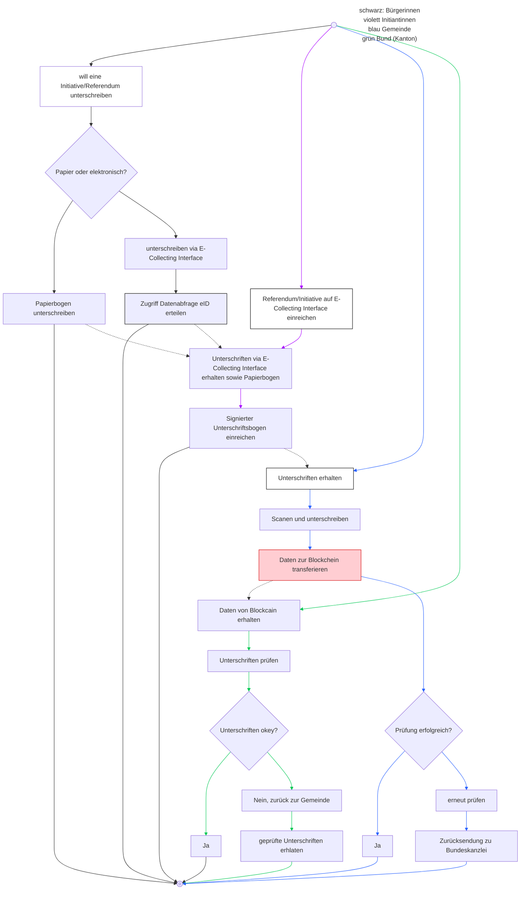
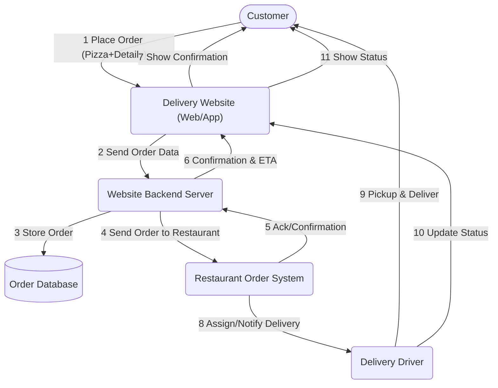
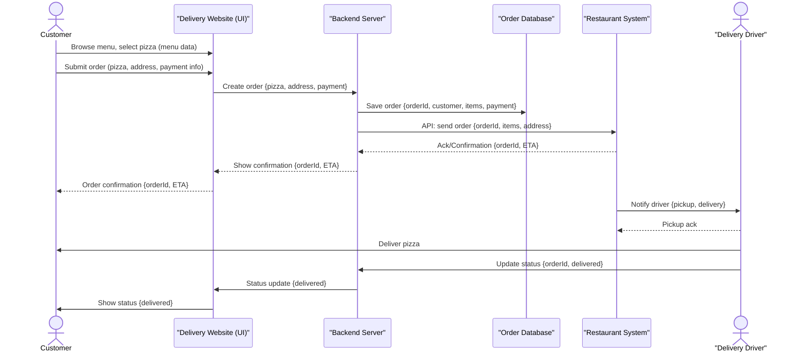

# 1) Voll-medienbruchfreies E-Collecting: direkte  Demokratie im digitalen Zeitalter

*Over the course of two days, you will develop your solution for collecting electronic signatures for popular initiatives and referendums from A to Z, addressing the 10 topics outlined in the [guidelines](https://www.bk.admin.ch/bk/de/home/politische-rechte/e-collecting/aktuelles.html). Your prototype can be conceptual, clickable, and/or technical. Either way, you should clearly present the interactions and data flows between actors, software, and infrastructure components over time, as well as the user experience of these actors.*

## Approach


**Sales pitch**


**Sales pitch version in PDF**
[Voll-medienbruchfreies-eCollecting_sales pitch.pdf](https://github.com/user-attachments/files/23126915/Voll-medienbruchfreies-eCollecting_sales.pitch.pdf)


## *Three bullet points that summarize it technically*

- API's
- Blockchain (Permissioned DLT)
- Dasboards & Audit-UI
  

## *User Journey*

**1. Digitale Teilnahme (eCollecting)**:
Bürger*in meldet sich über die eCollecting-Plattform an und loggt sich mit der eID ein.

**2. Stimmrechtsprüfung**:
Die Gemeinde-API fragt das kantonale Stimmregister ab und erhält ein OK/NICHT-OK zur Stimmberechtigung.

**3. Digitale Signatur und Speicherung**:
Wird die Unterschrift akzeptiert, erzeugt die Gemeinde ein signiertes Unterschrifts-Artefakt (z. B. PDF + Metadaten), speichert es verschlüsselt Off-Chain und erstellt daraus einen Hash (digitalen Fingerabdruck).

**4. Blockchain-Eintrag**:
Der Hash und relevante Metadaten (Zeitstempel, Gemeinde-ID, Status «gültig») werden als Transaktion in der Blockchain gespeichert. Mehrere Nodes validieren den Eintrag zur Sicherstellung der Transparenz und Unveränderlichkeit.
→ Die Zentrale (Bund-/Staatskanzlei) kann alle gültigen Einträge automatisch zählen.

**5. Papierbezogene Unterschriften (manuelle Ergänzung)**:
Für Unterschriften, die auf Papier bei der Gemeinde eingehen, prüft die Gemeinde die Stimmberechtigung analog oder via eID-Abfrage, digitalisiert das Formular (Scan + Metadaten) und erzeugt denselben Blockchain-Hash-Prozess wie bei digitalen Einträgen.
→ Damit erscheinen digitale und papierbasierte Unterstützungen gleichwertig in der Blockchain.

**6. Komitee-Dashboard & Monitoring**:
Komitees und Behörden können über ein Dashboard in Echtzeit sehen, wie viele gültige Unterstützungen (digital + Papier) vorliegen – ohne personenbezogene Daten, aber mit nachvollziehbarer Transparenz und Auditierbarkeit dank Blockchain.

*English Version*

**1. Digital participation (eCollecting)**: Citizens register via the eCollecting platform and log in with their eID.
**2. Voting rights check**: The municipal API queries the cantonal voting register and receives an OK/NOT OK for voting rights.
**3. Digital signature and storage**: If the signature is accepted, the municipality generates a signed signature artifact (e.g., PDF + metadata), stores it encrypted off-chain, and creates a hash (digital fingerprint) from it.
**4. Blockchain entry**: The hash and relevant metadata (timestamp, municipal ID, “valid” status) are stored as a transaction in the blockchain. Multiple nodes validate the entry to ensure transparency and immutability. → The central office (federal/state chancellery) can automatically count all valid entries.
**5. Paper-based signatures (manual addition)**: For signatures received by the municipality on paper, the municipality checks voting eligibility analogously or via eID query, digitizes the form (scan + metadata), and generates the same blockchain hash process as for digital entries. → This means that digital and paper-based support appear equally in the blockchain.
**6. Committee dashboard & monitoring**: Committees and authorities can use a dashboard to see in real time how many valid endorsements (digital + paper) have been received—without personal data, but with traceable transparency and auditability thanks to blockchain.


## *Main challenges*
  
Blockchain:
- **Off-Chain Storage (verschlüsselt)**: Persönliche Daten und komplette Signatur-Artefakte bleiben bei der Gemeinde oder in einem verschlüsselten föderalistischen Datenspeicher
- **Blockchain (Permissioned DLT)**: Speichert Prüfergebnisse, Transaktions-Metadaten, Hashes von Unterschriftsartefakten, Zeitstempel, Statusflags (z. B. gültig, zurückgezogen)
- **Blockchain-Integration** papierbasierter Unterschriften
- **Smart Contracts / Chaincode**: Regeln Validierung, Aufnahme, Grundregeln für Revocation und Übermittlung an die zentrale Stelle
- **Zentrale Zählkomponente (Bund-/Staatskanzlei)**: Liest die Blockchain, zählt Referenzen (verifiziert mit Smart Contract Logik)

Gemeinde-API:
- Kommuniziert mit eID, verifiziert Stimmberechtigung über kantonale Stimmregister
  

## *Sub-challenges*

- **eID-System**: Identifizierung & digitale Signatur der Stimmberechtigten (Login + Signatur)
- **eCollecting Plattform**: Wo Bürger unterschreiben
- **Dashboards & Audit-UI**: Für Komitees/Kantone/öffentliche Transparenz (mit Rollen & Zugriffskontrolle)

## *Required skills*   
- UX/UI Designer						(Prototyp: Bürger-Flow & Behörden-Dashboard)
- Frontend Developer                   	(React/Next.js – Login, Signatur & Bestätigung)
- Backend Developer                 	(API-Simulation eID-Gemeinde–Bund)
- Security Engineer                 	(Proof-of-Concept für eID-Verifikation & Datenintegrität)
- DevOps                             	(Setup & GitHub-Dokumentation, CI/CD)
- Legal/Policy Researcher            	(Rechtliche Rahmenbedingungen & Datenschutz)


## Documentation and Diagrams

*Together, you will contribute to comparing different ways of how to implement e-collecting in Switzerland from A to Z. As part of the [participatory process](https://www.bk.admin.ch/bk/de/home/politische-rechte/e-collecting/partizipativer_prozess.html), your solutions will be discussed in subsequent workshops and will possibly be taken into account for the official decision on the design of the federal e-collecting trials. Proper documentation is key to ensuring that your solution can be understood and evaluated:*

# 🇨🇭 eCollecting – Blockchain-basierte Nachvollziehbarkeit für Volksinitiativen und Referenden

## 🧭 Übersicht

Dieses Projekt beschreibt die **technische Architektur** und den **Ablauf** eines föderalen, datenschutzkonformen eCollecting-Systems, das sowohl **digitale** als auch **papierbasierte Unterschriften** sicher und nachvollziehbar verarbeitet.  
Ziel: **Integrität, Transparenz und Nachvollziehbarkeit**, ohne dass personenbezogene Daten auf der Blockchain gespeichert werden.

---

## 📑 Inhaltsverzeichnis

1. [Was macht die Blockchain hier?](#1-was-macht-die-blockchain-hier)  
2. [Wichtige Design-Entscheidung](#2-wichtige-design-entscheidung)  
3. [Systemkomponenten](#3-systemkomponenten)  
4. [Ablauf (User Journey)](#4-ablauf-user-journey)  
5. [On-Chain Daten](#5-on-chain-daten)  
6. [Revocation / Rückzug](#6-revocation--rückzug)  
7. [Datenschutz-Techniken](#7-datenschutz-techniken)  
8. [Authentisierung & Schlüsselmanagement](#8-authentisierung--schlüsselmanagement)  
9. [Smart Contracts](#9-smart-contracts)  
10. [Papierbasierte Unterschriften – Integration](#10-papierbasierte-unterschriften--integration)  
11. [Beispielhafte Datenstrukturen & Smart-Contract-Pseudocode](#11-beispielhafte-datenstrukturen--smart-contract-pseudocode)  
12. [Sicherheit & Rechtliches](#12-sicherheit--rechtliches)  
13. [Empfehlungen für Betrieb & Audit](#13-empfehlungen-für-betrieb--audit)  
14. [Governance & Betrieb](#14-governance--betrieb)  
15. [Vor- & Nachteile](#15-vor--nachteile)  
16. [Technische Optionen](#16-technische-optionen)  
17. [Bedrohungsmodell & Gegenmaßnahmen](#17-bedrohungsmodell--gegenmaßnahmen)  
18. [Roadmap / Umsetzung](#18-roadmap--umsetzung)  
19. [Nächste Schritte](#19-nächste-schritte)

---

## 1. Was macht die Blockchain hier?

Stell dir die Blockchain als ein **unveränderliches Buch** vor, das von **Gemeinden, Kantonen und dem Bund** gemeinsam geführt wird.  
Jede gültige Unterschrift wird mit einem eindeutigen Fingerabdruck (Hash) eingetragen.

**Funktionen:**
- Nachvollziehbar: Wer wann wie viele Unterschriften übermittelt hat.  
- Manipulationssicher: Keine nachträglichen Änderungen möglich.  
- Dezentral: Behörden können unabhängig prüfen und zählen.  

📘 **Wichtig:** Keine Personendaten im Klartext!  
Gespeichert werden nur Prüfergebnisse & kryptografische Hashes.

---

## 2. Wichtige Design-Entscheidung

> **Permissioned Blockchain** – Nur staatliche Akteure (Gemeinden, Kantone, Bund) betreiben Nodes.  
> Dadurch sind **Governance, Datenschutz und rechtliche Verantwortung** klar geregelt.

---

## 3. Systemkomponenten

| Komponente | Beschreibung |
|-------------|---------------|
| **eID-System** | Authentifizierung & Signatur der Stimmberechtigten |
| **Gemeinde-API / eCollecting-Plattform** | Webplattform für Bürger, prüft Stimmberechtigung |
| **Off-Chain Storage** | Verschlüsselte Speicherung persönlicher Daten & Artefakte |
| **Blockchain (DLT)** | Speichert Prüfergebnisse, Hashes & Statusflags |
| **Smart Contracts** | Regeln Validierung, Rückzug & Counting |
| **Zentrale Zählkomponente (Bund)** | Aggregiert & zählt on-chain Einträge |
| **Dashboards / Audit-UI** | Transparenz & Monitoring für Behörden & Öffentlichkeit |

---

## 4. Ablauf (User Journey)

1. Bürger loggt sich via eID ein und unterschreibt.
2. Gemeinde prüft Stimmberechtigung.
3. Unterschrift wird als Artefakt verschlüsselt off-chain gespeichert.
4. Hash + Metadaten werden in der Blockchain erfasst.
5. Bund zählt on-chain Einträge nach Smart-Contract-Logik.


---
config:
  theme: redux
---


## 5. On-Chain Daten

**Gespeichert wird nur das Minimum:**

- Hash des Unterschriftsartefakts  
- Zeitstempel  
- Gemeinde/Kanton-ID  
- Statusflag (gültig, zurückgezogen, etc.)  
- Referenz zum verschlüsselten Off-Chain-Objekt  

**Datenschutz:** DSG/GDPR-konform – keine sensiblen Personendaten on-chain.

---

## 6. Revocation / Rückzug

- Blockchain = *append-only*: Einträge werden nie gelöscht.  
- Rückzug erfolgt über neue Transaktion, die auf den ursprünglichen Hash verweist.  
- Nur Status wird geändert (`valid → revoked`).  
- Smart Contract berücksichtigt nur gültige Einträge bei Zählung.  

→ **Nachvollziehbar, transparent, revisionssicher.**

---

## 7. Datenschutz-Techniken

- **Hashing** statt Klartext  
- **Off-Chain Verschlüsselung** (HSM/KMS-basiert)  
- **Rollenbasierte Zugriffsrechte**  
- **Pseudonymisierung & Minimaldatenprinzip**  
- **Zero-Knowledge Proofs (ZKP)** (optional): Nachweis von Gültigkeit ohne Offenlegung von Personendaten

---

## 8. Authentisierung & Schlüsselmanagement

- Bürger signiert mit **eID** (juristische Signatur)  
- Gemeinden/Behörden nutzen **HSMs** zur Schlüsselsicherung  
- **TLS mit gegenseitiger Authentifizierung**, regelmäßige Schlüsselrotation

---

## 9. Smart Contracts

Definieren:
- Validierungsregeln (z. B. eID gültig)  
- Revocation-Regeln  
- Sichtbarkeitsregeln  
- Anforderungen für Zählung & Reporting

---

## 10. Papierbasierte Unterschriften – Integration

Auch **manuelle Unterschriften** können digital & blockchain-basiert nachgewiesen werden.

### Zwei Modi

| Modus | Beschreibung |
|--------|--------------|
| **Einzeln (Itemized)** | Jede Unterschrift einzeln gehasht und on-chain gebucht |
| **Batch (Merkle-Root)** | Viele Blätter → einzelne Hashes → Merkle-Root on-chain (performanter) |

---

## 11. Beispielhafte Datenstrukturen & Smart-Contract-Pseudocode

### Beispiel-Payload (Batch-Upload)

```json
{
  "type": "paper_signature_batch",
  "authority_id": "gemeinde-zh-123",
  "batch_id": "BATCH-2025-10-27-001",
  "merkle_root": "0x9f2...ab3",
  "count": 138,
  "timestamp": "2025-10-27T09:42:00Z",
  "chain_of_custody_ref": "coc://gemeinde-zh-123/BATCH-2025-10-27-001",
  "attestation_signature": "MEUCIQDb...",
  "metadata": {
    "scans_storage_ref": "s3://federated-gemeinden/zh/2025/BATCH-001.enc",
    "scan_format": "PDF/A-2",
    "hash_algorithm": "SHA-256"
  }
}

---

### Smart-Contract-Pseudocode 

```javascript
function submitBatch(authority_id, batch_id, merkle_root, count, timestamp, attestation) {
  require(isAuthorizedAuthority(authority_id), "Not permitted");
  require(verifySignature(authority_id.publicKey, merkle_root || batch_id || timestamp, attestation), "Invalid attestation");

  if (batches[batch_id].exists) revert("Batch already submitted");

  batches[batch_id] = {
    authority: authority_id,
    merkleRoot: merkle_root,
    count: count,
    timestamp: timestamp,
    status: "accepted"
  };
  emit BatchSubmitted(batch_id, authority_id, merkle_root, count, timestamp);
}
```

## 12. Sicherheit & Rechtliches

* Keine personenbezogenen Daten on-chain
* Off-Chain-Archivierung gesetzeskonform (PDF/A)
* Nur autorisierte Behörden dürfen attestieren
* Rückzüge dokumentiert via Revocation-Transaktion
* Auditlog & Timestamping verpflichtend

---

## 13. Empfehlungen für Betrieb & Audit

1. Standardisiertes **Chain-of-Custody-Formular** (physisch + digital)
2. Einheitliche **Scan-Richtlinien** (DPI, Format, Barcode)
3. **HSM-Signaturen** statt USB-Keys
4. **Multi-Sig-Freigabe** für Batch-Uploads
5. Regelmäßige **IT- & Datenschutz-Audits**
6. **Rechtsklärung** zu Zuständigkeit, Rückzugsrechten & Archivpflichten

---

## 14. Governance & Betrieb

* **Node-Betreiber:** Gemeinden, Kantone, Bund
* **Betriebsvereinbarungen:** SLAs, Sicherheitsstandards
* **Audits & PenTests:** Regelmäßig extern
* **Change Management:** Smart-Contract-Änderungen via Multi-Sig-Governance

---

## 15. Vor- & Nachteile

| Vorteile                     | Herausforderungen                   |
| ---------------------------- | ----------------------------------- |
| Integrität & Transparenz     | Hohe Koordination zwischen Behörden |
| Kein Single Point of Failure | Datenschutzarchitektur komplex      |
| Echtzeit-Auditierbarkeit     | Schlüsselmanagement kritisch        |
| Manipulationssicher          | Gesetzliche Anpassungen nötig       |

---

## 16. Technische Optionen

* **DLT-Frameworks:** Hyperledger Fabric, Corda, o. ä.
* **Off-Chain Storage:** Föderierter verschlüsselter Object-Store
* **Anchoring:** Periodisch Hash auf öffentlicher Blockchain
* **W3C Verifiable Credentials / DIDs:** Für eID-Integration

---

## 17. Bedrohungsmodell & Gegenmaßnahmen

| Bedrohung                | Gegenmaßnahme                              |
| ------------------------ | ------------------------------------------ |
| Manipulation             | Permissioned Konsensmechanismus            |
| Key-Diebstahl            | HSM, MFA, Key Recovery                     |
| Datendiebstahl Off-Chain | Verschlüsselung & Zugriffsrechte           |
| Gefälschte Nodes         | Zulassung nur für geprüfte Behörden        |
| Privacy Leaks            | Minimale Metadaten, ZKP, Pseudonymisierung |

---

## 18. Roadmap / Umsetzung

1. **Design-Workshop & Governance Agreement**
2. **PoC (5 Nodes, eID + Storage + Smart Contracts)**
3. **Pilotphase (ein Kanton, mehrere Gemeinden)**
4. **Evaluation & Skalierung**
5. **Rollout & permanente Governance**

---

## 19. Nächste Schritte

* Technisches Konzept (2–4 Seiten) erstellen
* Stakeholder-Workshop (Bund, Kantone, Gemeinden, Datenschutz, Juristen)
* PoC-Prototyp bauen (3–6 Monate): Permissioned DLT + eID-Integration + Dashboard

---


1. **[Mermaid](https://mermaid.js.org/) diagram(s) showing interactions and data flows between actors, software and infrastructure components of your solution over time.**
2. **Wireframes or mockups with user flow showing the user experience of different actors** (using e.g. Figma)
3. Explain how you addressed the topics presented in the [guidelines](https://www.bk.admin.ch/bk/de/home/politische-rechte/e-collecting/aktuelles.html), filling in the template below.
4. List the key strengths and weaknesses of your solution.
5. Explanation of features used (if applicable)
6. A requirements file with all packages and versions used (if applicable)
7. Environment code to be run (if applicable)

*For your reference, you will find below an example of two diagrams showing interactions and data flows between actors, software and infrastructure components of ordering a pizza via a third-party delivery website over time. Please replace them with diagrams for your solution.*

### Flowchart: High-level Process (Example)

*An overall process flow showing the main steps and system/actor interactions for ordering a pizza online via a delivery website, including software, infrastructure, and handoff to the restaurant and delivery driver.*



### Sequence Diagram: Detailed Interactions & Data Flows (Example)

*A step-by-step illustration showing how data and requests are exchanged between actors (customer, delivery site, restaurant, infrastructure), and key software components in the order process.*



## User Experience

*Add or reference wireframes or mockups with user flow showing the user experience of different actors.*

## Topics addressed

*Explain how you addressed the topics presented in the [guidelines](https://www.bk.admin.ch/bk/de/home/politische-rechte/e-collecting/aktuelles.html), filling in the template below.*

| Topic | (How) is it addressed? |
| -| ------- |
| 1 | Verschiedene User-Journey, eindeutige Komitee-ID, Menschen mit Beeinträchtigungen können Ihre politischen Rechte selbstbestimmt wahrnehmen|
| 2 | Mit Hilfe eines Dashboard werden die Daten für das Komitee in Echtzeit aufbereitet  |
| 3 | Die Blockchain-Technologie ermöglicht die gesammelten Unterstützungsbekundungen den Sammelorganisationen eindeutig zuzuschreiben |
| 5 | Starke Authentifizierung durch eID mit zusätzlicher Blockchain-Technologie verhindert Fälschungen |
| 6 | Mit Blockchain-Technologie und Dashboardvisualisierung der gezählten gültigen Stimmen in Echtzeit sind unterschlagene Unterstützungsbekundungen nicht mehr möglich |
| 7 | Stufe 3 |
| 8 | Anbindung Papierprozess - manuelle Überprüfung/Ergänzung direkt auf der Blockchain |

## Key Strenghts and Weaknesses

*List the key strengths and weaknesses of your solution.*

### Strengths:

- Integrität & Nachvollziehbarkeit (Manipulation praktisch ausgeschlossen)
- Verteilte Verantwortung (kein Single Point of Failure)
- Echtzeit-Transparenz für Komitees und behördliche Kontrolle (Counts / Monitoring)

### Weaknesses / Challenges:

- Komplexe Koordination zwischen Gemeinden/Kantonen/Bund
- Datenschutz erfordert strenge Architektur (keine Klartextdaten on-chain)
- Schlüsselmanagement-Risiko (gestohlene Schlüssel können Schaden anrichten)

## Getting Started

*These instructions will get you a copy of the technical prototype (if applicable) up and running on your local machine for development and testing purposes. **If you are not developing a technical prototype, please present or reference your conceptual and/or clickable prototype.***

### Prerequisites

*What things you need to install the software and how to install them.*

### Installation

*A step by step series of examples that tell you how to get a development env running.*

## Contributing

Please read [CONTRIBUTING.md](/CONTRIBUTING.md) for details on our code of conduct.

## Team Members

- [Marco Loppacher](https://github.com/LoppiNW1)(
  Team leader) 
- [Julia Wegmann](https://github.com/juliaNina)(Konzeptionlle Rolle)
- [Thomas Gemperle](https://github.com/thomasgemperle)(Backend Developer)
- [Hanna Franz](https://github.com/hannafranz)(Frontend Developer, UX-Designer)
- [Nicolas Meylan](https://github.com/Nicolas2030)(Beobachter)

## License

This software is licensed under a AGPL 3.0 License - see the [LICENSE](LICENSE) file for details. Please feel free to [choose any other](https://choosealicense.com/) [Open Source Initiative approved license](https://opensource.org/licenses) (e.g. a permissive license such as [MIT](https://opensource.org/license/mit)). Other content (e.g. text, images, etc.) is licensed under a [Creative Commons CC BY-SA 4.0 license](https://creativecommons.org/licenses/by-sa/4.0/deed.de). Exceptions are possible in consultation with the organizers.
