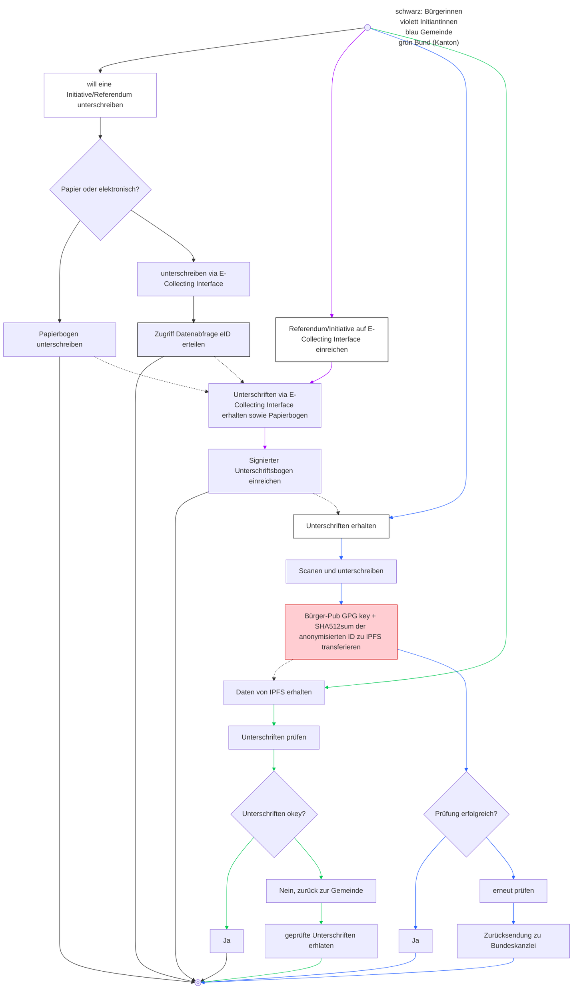

# 1) Voll-medienbruchfreies E-Collecting: direkte  Demokratie im digitalen Zeitalter

*Over the course of two days, you will develop your solution for collecting electronic signatures for popular initiatives and referendums from A to Z, addressing the 10 topics outlined in the [guidelines](https://www.bk.admin.ch/bk/de/home/politische-rechte/e-collecting/aktuelles.html). Your prototype can be conceptual, clickable, and/or technical. Either way, you should clearly present the interactions and data flows between actors, software, and infrastructure components over time, as well as the user experience of these actors.*

## Final presentation


## *User Journey*

**Animation-Prototyp**
https://github.com/swiss/e-collecting-hackathon-team1/issues/9#issue-3577729865

**1. Digitale Teilnahme**

Bürger*in meldet sich über die eCollecting-Plattform an und authentifiziert sich mit einer staatlich geprüften eID.
Nach erfolgreichem Login wird ein Unterschriftsvorgang gestartet.

**2. Stimmrechtsprüfung**

Die Gemeinde-API fragt das kantonale Stimmregister ab und prüft, ob die Person stimmberechtigt ist.
Ergebnis: OK/NICHT-OK – wird nur für die Prüfung genutzt, nicht gespeichert.

**3. Digitale Signatur & Speicherung**

Wenn gültig:

- Gemeinde erstellt ein signiertes Unterschrifts-Artefakt (z. B. PDF + Metadaten)
- Artefakt wird verschlüsselt im föderalistischen IPFS-Cluster gespeichert
- Aus dem Inhalt entsteht ein CID (Content Identifier) – der eindeutige Hash des Objekts

Ein CID-Registry speichert Metadaten wie Zeitstempel, Gemeinde-ID und Status.

**4. IPFS-Einträge & Validierung**

- Gemeinde übermittelt: CID, Zeitstempel, Gemeinde-ID, Status („gültig“, „zurückgezogen“)
- Mehrere IPFS-Nodes (Gemeinden, Kantone, Bund) pinnen und replizieren das Objekt
- Die Bundes- oder Staatskanzlei kann über die Registry alle gültigen Einträge zählen – ohne Zugriff auf personenbezogene Daten

**5. Papierbezogene Unterschriften**

Für physische Unterschriften:

1. Gemeinde prüft Stimmberechtigung
2. Scan + Metadaten werden erstellt und verschlüsselt gespeichert
3. Ein CID wird generiert und in der Registry eingetragen  
→ **Papier und Digital** sind vollständig gleichwertig abgebildet

**6. Komitee-Dashboard & Monitoring**

Ein Dashboard zeigt in Echtzeit:

- Anzahl gültiger Unterstützungen (digital & Papier)
- Verteilung nach Gemeinden/Kantonen
- Auditierbarkeit via CIDs

**Keine personenbezogenen Daten** – nur verifizierbare Hashes & Metadaten.

**7. Bürger*innen-Selbstprüfung**

Bürger*innen können prüfen, ob ihre Unterschrift registriert wurde:  
→ über einen CID-Lookup oder eine anonyme Prüfreferenz
Nur der Hash wird angezeigt – keine Identitätsdaten.

## *Main challenges*
  
**Off-Chain Storage (Verschlüsselt)**
- Persönliche Daten und vollständige Signatur-Artefakte bleiben bei der Gemeinde oder in einem verschlüsselten IPFS-Cluster
- Speicherung erfolgt Ende-zu-Ende-verschlüsselt (AES-256-GCM)

**IPFS-Registry (föderalistisches Index-System)**

- Verwaltet CIDs, Metadaten und Statusflags
- Nur autorisierte Behördennodes dürfen Einträge vornehmen
- Unterstützt Versionsverwaltung über IPNS (z. B. bei Revocation oder Neusignatur)

**Integration papierbasierter Unterschriften**
- Scans werden lokal verifiziert, anschließend gehasht, verschlüsselt und hochgeladen
- CID + Metadaten gehen in die zentrale Registry
- Papier- und Digitalvorgänge sind vollständig interoperabel
  

## *Sub-challenges*

- **eID-System**: Identifizierung & digitale Signatur der Stimmberechtigten (Login + Signatur)
- **eCollecting Plattform**: Wo Bürger unterschreiben
- **Dashboards & Audit-UI**: Für Komitees/Kantone/öffentliche Transparenz (mit Rollen & Zugriffskontrolle)

## *Required skills*   
- UX/UI Designer						(Prototyp: Bürger-Flow & Behörden-Dashboard)
- Frontend Developer                   	(React/Next.js – Login, Signatur & Bestätigung)
- Backend Developer                 	(API-Simulation eID-Gemeinde–Bund)
- Security Engineer                 	(Proof-of-Concept für eID-Verifikation & Datenintegrität)
- DevOps                             	(Setup & GitHub-Dokumentation, CI/CD)
- Legal/Policy Researcher            	(Rechtliche Rahmenbedingungen & Datenschutz)


## Documentation and Diagrams


# eCollecting – **IPFS – Technische Architektur**

## Übersicht

Dieses Projekt beschreibt die **technische Architektur** und den **Ablauf** eines föderalistischen, datenschutzkonformen eCollecting-Systems, das sowohl **digitale** als auch **papierbasierte Unterschriften** sicher und nachvollziehbar verarbeitet.
Ziel: **Integrität, Transparenz und Nachvollziehbarkeit**, ohne dass personenbezogene Daten auf zentralen Servern gespeichert werden.

---

##  Inhaltsverzeichnis

1. [Was macht IPFS hier?](#1-was-macht-ipfs-hier)
2. [Wichtige Design-Entscheidung](#2-wichtige-design-entscheidung)
3. [Systemkomponenten](#3-systemkomponenten)
4. [Ablauf (User Journey)](#4-ablauf-user-journey)
5. [IPFS-Datenobjekte](#5-ipfs-datenobjekte)
6. [Revocation / Rückzug](#6-revocation--rückzug)
7. [Datenschutz-Techniken](#7-datenschutz-techniken)
8. [Authentisierung & Schlüsselmanagement](#8-authentisierung--schlüsselmanagement)
9. [Metadaten & Integritätsnachweis](#9-metadaten--integritätsnachweis)
10. [Papierbasierte Unterschriften – Integration](#10-papierbasierte-unterschriften--integration)
11. [Beispielhafte Datenstrukturen & Upload-Logik](#11-beispielhafte-datenstrukturen--upload-logik)
12. [Sicherheit & Rechtliches](#12-sicherheit--rechtliches)
13. [Empfehlungen für Betrieb & Audit](#13-empfehlungen-für-betrieb--audit)
14. [Governance & Betrieb](#14-governance--betrieb)
15. [Vor und Nachteile](#15-vor-und-nachteile)
16. [Technische Optionen](#16-technische-optionen)
17. [Bedrohungsmodell & Gegenmaßnahmen](#17-bedrohungsmodell--gegenmaßnahmen)
18. [Roadmap / Umsetzung](#18-roadmap--umsetzung)

---

## 1. Was macht IPFS hier?

Stell dir IPFS als ein **verteiltes Archivsystem** vor, das von **Gemeinden, Kantonen und dem Bund** gemeinsam betrieben wird.
Jede gültige Unterschrift wird als **verschlüsseltes Objekt** gespeichert und über ihren **Inhalts-Hash (CID)** eindeutig identifiziert.

**Funktionen:**

* Nachvollziehbar: Wer wann wie viele Unterschriften abgelegt hat.
* Manipulationssicher: Inhalte können nachträglich nicht verändert werden.
* Dezentral: Behörden können unabhängig prüfen und zählen.

 **Wichtig:** Keine Personendaten im Klartext!
Gespeichert werden nur verschlüsselte Artefakte & Metadaten-Hashes.

**Prototyp-Image der Implementation** 


---

## 2. Wichtige Design-Entscheidung

> **IPFS-Netzwerk (Private IPFS Cluster)** – Nur staatliche Akteure (Gemeinden, Kantone, Bund) betreiben Nodes.
> Dadurch sind **Governance, Datenschutz und rechtliche Verantwortung** klar geregelt.

---

## 3. Systemkomponenten

| Komponente                                      | Beschreibung                                           |
| ----------------------------------------------- | ------------------------------------------------------ |
| **eID-System**                                  | Authentifizierung & Signatur der Stimmberechtigten     |
| **eCollecting-Plattform**                       | Wo Bürger unterschreiben        |
| **Verschlüsselter Object-Store (IPFS Cluster)** | Speicherung persönlicher Artefakte, Signaturen, Scans  |
| **CID-Registry (Index-Dienst)**                 | Erfasst Hashes, Status & Metadaten                     |
| **Integrity Proof Service**                     | Verifiziert Integrität & Zeitstempel                   |
| **Zentrale Zählkomponente (Bund)**              | Aggregiert & prüft Metadaten                           |
| **Dashboards / Audit-UI**                       | Transparenz & Monitoring für Behörden & Öffentlichkeit |

---

## 4. Ablauf (User Journey)

1. Bürger loggt sich via eID ein und unterschreibt.
2. Gemeinde prüft Stimmberechtigung.
3. Verschlüsselung & Upload der Unterschrift:

   * Signatur-Artefakt wird verschlüsselt.
   * Artefakt + Metadaten werden auf IPFS hochgeladen.
   * CID wird im föderalen Index-System registriert.
4. Bund zählt registrierte CIDs und prüft Integrität über Hashes.

---



---

## 5. IPFS-Datenobjekte

**Gespeichert wird nur das Minimum:**

* Verschlüsseltes Unterschriftsartefakt
* CID (Content Identifier, z. B. `Qm...xyz`)
* Zeitstempel & Prüfsumme
* Gemeinde/Kanton-ID
* Statusflag (gültig, zurückgezogen etc.)
* Optionale Referenz zu Papierdokument (Merkle-Root oder UUID)

**Datenschutz:** DSG/GDPR-konform – keine sensiblen Personendaten unverschlüsselt gespeichert.

---

## 6. Revocation / Rückzug

* IPFS ist *content-addressed* – Änderungen erzeugen neue CIDs.
* Rückzug erfolgt durch **neue Version des Metadatenobjekts** mit `status: revoked`.
* Historie bleibt nachvollziehbar über die Versionskette (`IPNS` oder Registry-Verlauf).

→ **Transparent, unveränderlich, revisionssicher.**

---

## 7. Datenschutz-Techniken

* **Ende-zu-Ende-Verschlüsselung** aller Artefakte
* **CID-basierte Pseudonymisierung**
* **Private IPFS Cluster + Access Tokens**
* **Zero-Knowledge Proofs (ZKP)** optional zur Validierung
* **Keine Metadatenlecks** durch dedizierte Gateway-Architektur

---

## 8. Authentisierung & Schlüsselmanagement

* Bürger signiert mit **eID** (juristische Signatur)
* Gemeinden & Behörden nutzen **HSMs oder KMS** für Schlüssel
* **Signierte IPFS-Pins** (Authentizität gesichert)
* **TLS + gegenseitige Authentifizierung** zwischen Nodes

---

## 9. Metadaten & Integritätsnachweis

Eine separate föderalistische **CID-Registry** speichert:

* CID
* Signatur der hochladenden Behörde
* Zeitstempel
* Status (valid / revoked / counted)
* Prüfsumme (Hash über Dateiinhalt)

Optional kann regelmäßig ein **Merkle-Root über alle Tages-CIDs** gebildet und als Audit-Beleg (z. B. in öffentlichem Journal oder Blockchain-Anker) abgelegt werden.

---

## 10. Papierbasierte Unterschriften – Integration

Auch **Papierunterschriften** können über IPFS nachgewiesen werden.
Gemeinden digitalisieren geprüfte Papierbögen, erzeugen daraus **Hashes & CIDs**, und laden die verschlüsselten Artefakte in den Cluster.

### Zwei Modi

| Modus                   | Beschreibung                                                             |
| ----------------------- | ------------------------------------------------------------------------ |
| **Einzeln (Itemized)**  | Jede Unterschrift einzeln gehasht und auf IPFS gespeichert               |
| **Batch (Merkle-Root)** | Mehrere Scans → Hashbaum → Merkle-Root-Objekt gespeichert (performanter) |

---

## 11. Beispielhafte Datenstrukturen & Upload-Logik

### Beispiel-Payload (Batch-Upload)

```json
{
  "type": "paper_signature_batch",
  "authority_id": "gemeinde-zh-123",
  "batch_id": "BATCH-2025-10-27-001",
  "merkle_root": "0x9f2...ab3",
  "count": 138,
  "timestamp": "2025-10-27T09:42:00Z",
  "ipfs_cid": "QmXyz123...",
  "attestation_signature": "MEUCIQDb...",
  "metadata": {
    "storage_ref": "ipfs://QmXyz123...",
    "scan_format": "PDF/A-2",
    "hash_algorithm": "SHA-256"
  }
}
```

### Beispielhafte Upload-Logik (Pseudocode)

```javascript
async function submitBatch(batchData, privateKey) {
  const cid = await ipfs.add(encrypt(batchData));
  const attestation = sign(privateKey, cid + batchData.timestamp);
  registry.add({
    cid,
    authority: batchData.authority_id,
    merkle_root: batchData.merkle_root,
    count: batchData.count,
    status: "accepted",
    attestation
  });
  emit("BatchSubmitted", cid, batchData.authority_id, batchData.count);
}
```

---

## 12. Sicherheit & Rechtliches

* Keine Klartextdaten in IPFS
* Off-Chain-Archivierung gesetzeskonform (PDF/A)
* Autorisierte Behörden signieren Uploads
* Rückzüge dokumentiert über neue Versionen
* Auditlog & Zeitstempelung verpflichtend

---

## 13. Empfehlungen für Betrieb & Audit

1. Standardisierte **CID-Registry** mit Audit-Trail
2. Einheitliche **Scan-Richtlinien** (DPI, Format, Hash-Algorithmen)
3. **HSM-Signaturen** für Uploads
4. **Multi-Sig-Genehmigungen** bei Batch-Uploads
5. **Datenschutz- & Sicherheits-Audits** jährlich
6. **Juristische Klärung** zu Aufbewahrung & Rückzugspflichten

---

## 14. Governance & Betrieb

* **Cluster-Betreiber:** Gemeinden, Kantone, Bund
* **Betriebsvereinbarungen:** SLAs, Datenschutz, Replikationsrichtlinien
* **Audits & PenTests:** Regelmäßig extern
* **Governance via Multi-Sig & gemeinsame Kontrolle**

---

## 15. Vor– und Nachteile

| Vorteile                                | Herausforderungen                         |
| --------------------------------------- | ----------------------------------------- |
| Dezentral, kein Single Point of Failure | Koordination vieler Behörden              |
| DSG-konform durch Verschlüsselung       | Aufwändiges Schlüsselmanagement           |
| Transparente Integritätsnachweise       | Versionierung & Zugriffskontrolle komplex |
| Geringe Abhängigkeit von Blockchain     | Rechtliche Anerkennung neu zu definieren  |

---

## 16. Technische Optionen

* **IPFS-Cluster (Private Network Mode)**
* **libp2p Access Control Lists (ACL)**
* **Merkle-DAG für Batch-Strukturen**
* **IPNS für Revocation und Updates**
* **W3C Verifiable Credentials / DIDs** für eID-Integration

---

## 17. Bedrohungsmodell & Gegenmaßnahmen

| Bedrohung            | Gegenmaßnahme                             |
| -------------------- | ----------------------------------------- |
| Manipulierte Uploads | Digitale Signaturen, CID-Validierung      |
| Key-Diebstahl        | HSM, MFA, Key Recovery                    |
| Datenlecks           | Verschlüsselung, private Cluster          |
| Unautorisierte Pins  | Node-ACL, Access Tokens                   |
| Privacy Leaks        | Pseudonymisierung, ZKP, Gateway-Isolation |

---

## 18. Roadmap / Umsetzung

1. **Design-Workshop & Governance Agreement**
2. **PoC (5 IPFS-Nodes + eID + CID-Registry)**
3. **Pilotphase (ein Kanton, mehrere Gemeinden)**
4. **Evaluation & Skalierung**
5. **Rollout & Betrieb**

**Nächste Schritte**

* Technisches Konzept (2–4 Seiten) ausarbeiten
* Stakeholder-Workshop (Bund, Kantone, Gemeinden, Datenschutz, Juristen)
* PoC-Prototyp (3–6 Monate): Private IPFS-Cluster + eID + Audit-Dashboard

---

## User Experience

*Add or reference wireframes or mockups with user flow showing the user experience of different actors.*

## Topics addressed

*Explain how you addressed the topics presented in the [guidelines](https://www.bk.admin.ch/bk/de/home/politische-rechte/e-collecting/aktuelles.html), filling in the template below.*

| Topic | (How) is it addressed? |
| -| ------- |
| 1 | Verschiedene User-Journeys mit eindeutiger Komitee-ID werden unterstützt. Menschen mit Beeinträchtigungen können ihre politischen Rechte selbstbestimmt wahrnehmen – die eCollecting-Plattform ist barrierefrei und föderal betriebena |
| 2 | Ein Dashboard bereitet die in IPFS gespeicherten und signierten Unterstützungsdaten in Echtzeit für das Komitee auf (via CID-Registry-Streaming oder Event-Pinning)  |
| 3 | Die IPFS-Technologie ermöglicht es, jede Unterstützung eindeutig einem Komitee und einer Gemeinde zuzuordnen – über kryptografische Content-IDs (CIDs) und digitale Signaturen |
| 5 | Eine starke Authentifizierung über die staatliche eID und eine signierte IPFS-Registry stellen sicher, dass Einträge echt und fälschungssicher sind – jede Unterstützung trägt die geprüfte Herkunft (Gemeinde-Signatur) |
| 6 | Durch IPFS-Pinning, CID-Registry und das Dashboard können die gezählten gültigen Unterstützungen in Echtzeit überprüft werden. Dadurch werden unterschlagene oder doppelt gezählte Unterstützungen ausgeschlossen |
| 7 | Stufe 3 |
| 8 | Anbindung Papierprozess: Papierunterschriften werden gescannt, digital signiert, verschlüsselt im IPFS gespeichert und mit einem CID versehen. Diese werden in der Registry verknüpft und gleichwertig zu digitalen Einträgen behandelt |

## Key Strenghts and Weaknesses

*List the key strengths and weaknesses of your solution.*

### Strengths:

- **Integrität & Nachvollziehbarkeit**: Manipulation praktisch ausgeschlossen – jede gespeicherte Datei ist über ihren **Content Identifier (CID)** eindeutig überprüfbar
- **Verteilte Verantwortung**: Keine zentrale Instanz – Gemeinden, Kantone und Bund betreiben gemeinsam den **IPFS-Cluster**    
→ Kein Single Point of Failure.
- **Echtzeit-Transparenz**: Komitees und Behörden sehen über das **Dashboard** jederzeit die aktuelle Anzahl gültiger Unterstützungen (CID-basiert)    
→ Auditierbar und nachvollziehbar ohne personenbezogene Daten

### Weaknesses / Challenges:

- **Komplexe Koordination**: Erfordert enge organisatorische Abstimmung zwischen Gemeinden/Kantonen/Bund (Node-Governance, Replikationsrichtlinien)
- **Datenschutz + Architektur**: Strikte Trennung von **Daten (verschlüsselt im IPFS)** und **Metadaten (in der CID-Registry)** notwendig, um DSG-/DSGVO-Konformität sicherzustellen   
→ Keine Klartextdaten oder personenbezogenen Informationen im IPFS-Index
- **Schlüssel- & Zugriffsmanagement**: Verlust oder Diebstahl von Signatur-Schlüsseln (z. B. der Gemeinden) kann Integrität gefährden   
→ Einsatz von **HSMs**, **Key-Rotation** und **Multi-Signature-Freigaben**

## Getting Started

*These instructions will get you a copy of the technical prototype (if applicable) up and running on your local machine for development and testing purposes. **If you are not developing a technical prototype, please present or reference your conceptual and/or clickable prototype.***

### Prerequisites

*What things you need to install the software and how to install them.*

### Installation

*A step by step series of examples that tell you how to get a development env running.*

## Contributing

Please read [CONTRIBUTING.md](/CONTRIBUTING.md) for details on our code of conduct.

## Team Members

- [Marco Loppacher](https://github.com/LoppiNW1) (Team leader) 
- [Julia Wegmann](https://github.com/juliaNina) (Konzeptionelle Rolle)
- [Thomas Gemperle](https://github.com/thomasgemperle) (Backend Developer)
- [Hanna Franz](https://github.com/hannafranz) (Frontend Developer, UX-Designer)
- [Nicolas](https://github.com/Nicolas2030) (Beobachter)

## License

This software is licensed under a AGPL 3.0 License - see the [LICENSE](LICENSE) file for details. Please feel free to [choose any other](https://choosealicense.com/) [Open Source Initiative approved license](https://opensource.org/licenses) (e.g. a permissive license such as [MIT](https://opensource.org/license/mit)). Other content (e.g. text, images, etc.) is licensed under a [Creative Commons CC BY-SA 4.0 license](https://creativecommons.org/licenses/by-sa/4.0/deed.de). Exceptions are possible in consultation with the organizers.
