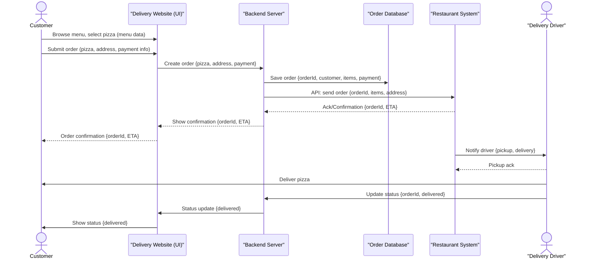

# 1) Voll-medienbruchfreies E-Collecting: direkte  Demokratie im digitalen Zeitalter

*Over the course of two days, you will develop your solution for collecting electronic signatures for popular initiatives and referendums from A to Z, addressing the 10 topics outlined in the [guidelines](https://www.bk.admin.ch/bk/de/home/politische-rechte/e-collecting/aktuelles.html). Your prototype can be conceptual, clickable, and/or technical. Either way, you should clearly present the interactions and data flows between actors, software, and infrastructure components over time, as well as the user experience of these actors.*

## Approach

**Sales pitch**

**Sales pitch version in PDF**
[Voll-medienbruchfreies-eCollecting_sales pitch.pdf](https://github.com/user-attachments/files/23126915/Voll-medienbruchfreies-eCollecting_sales.pitch.pdf)

## *Three bullet points that summarize it technically*

- API's
- Blockchain (Permissioned DLT)
- Dasboards & Audit-UI
  

## *User Journey*

**1. Digitale Teilnahme (eCollecting)**:
Bürger*in meldet sich über die eCollecting-Plattform an und loggt sich mit der eID ein.

**2. Stimmrechtsprüfung**:
Die Gemeinde-API fragt das kantonale Stimmregister ab und erhält ein OK/NICHT-OK zur Stimmberechtigung.

**3. Digitale Signatur und Speicherung**:
Wird die Unterschrift akzeptiert, erzeugt die Gemeinde ein signiertes Unterschrifts-Artefakt (z. B. PDF + Metadaten), speichert es verschlüsselt Off-Chain und erstellt daraus einen Hash (digitalen Fingerabdruck).

**4. Blockchain-Eintrag**:
Der Hash und relevante Metadaten (Zeitstempel, Gemeinde-ID, Status «gültig») werden als Transaktion in der Blockchain gespeichert. Mehrere Nodes validieren den Eintrag zur Sicherstellung der Transparenz und Unveränderlichkeit.
→ Die Zentrale (Bund-/Staatskanzlei) kann alle gültigen Einträge automatisch zählen.

**5. Papierbezogene Unterschriften (manuelle Ergänzung)**:
Für Unterschriften, die auf Papier bei der Gemeinde eingehen, prüft die Gemeinde die Stimmberechtigung analog oder via eID-Abfrage, digitalisiert das Formular (Scan + Metadaten) und erzeugt denselben Blockchain-Hash-Prozess wie bei digitalen Einträgen.
→ Damit erscheinen digitale und papierbasierte Unterstützungen gleichwertig in der Blockchain.

**6. Komitee-Dashboard & Monitoring**:
Komitees und Behörden können über ein Dashboard in Echtzeit sehen, wie viele gültige Unterstützungen (digital + Papier) vorliegen – ohne personenbezogene Daten, aber mit nachvollziehbarer Transparenz und Auditierbarkeit dank Blockchain.

## *Main challenges*
  
Blockchain:
- **Off-Chain Storage (verschlüsselt)**: Persönliche Daten und komplette Signatur-Artefakte bleiben bei der Gemeinde oder in einem verschlüsselten föderalistischen Datenspeicher
- **Blockchain (Permissioned DLT)**: Speichert Prüfergebnisse, Transaktions-Metadaten, Hashes von Unterschriftsartefakten, Zeitstempel, Statusflags (z. B. gültig, zurückgezogen)
- **Blockchain-Integration** papierbasierter Unterschriften
- **Smart Contracts / Chaincode**: Regeln Validierung, Aufnahme, Grundregeln für Revocation und Übermittlung an die zentrale Stelle
- **Zentrale Zählkomponente (Bund-/Staatskanzlei)**: Liest die Blockchain, zählt Referenzen (verifiziert mit Smart Contract Logik)

Gemeinde-API:
- Kommuniziert mit eID, verifiziert Stimmberechtigung über kantonale Stimmregister
  

## *Sub-challenges*

- **eID-System**: Identifizierung & digitale Signatur der Stimmberechtigten (Login + Signatur)
- **eCollecting Plattform**: Wo Bürger unterschreiben
- **Dashboards & Audit-UI**: Für Komitees/Kantone/öffentliche Transparenz (mit Rollen & Zugriffskontrolle)

## *Required skills*   
- UX/UI Designer						(Prototyp: Bürger-Flow & Behörden-Dashboard)
- Frontend Developer                   	(React/Next.js – Login, Signatur & Bestätigung)
- Backend Developer                 	(API-Simulation eID-Gemeinde–Bund)
- Security Engineer                 	(Proof-of-Concept für eID-Verifikation & Datenintegrität)
- DevOps                             	(Setup & GitHub-Dokumentation, CI/CD)
- Legal/Policy Researcher            	(Rechtliche Rahmenbedingungen & Datenschutz)

## Documentation and Diagrams

*Together, you will contribute to comparing different ways of how to implement e-collecting in Switzerland from A to Z. As part of the [participatory process](https://www.bk.admin.ch/bk/de/home/politische-rechte/e-collecting/partizipativer_prozess.html), your solutions will be discussed in subsequent workshops and will possibly be taken into account for the official decision on the design of the federal e-collecting trials. Proper documentation is key to ensuring that your solution can be understood and evaluated:*

Technische Umsetzung

1) Kurze, non-tech Erklärung: «Was macht die Blockchain hier?»

Stell dir die Blockchain als ein unveränderliches Buch vor, das viele unabhängige Verwahrer (Gemeinden, Kantone, Bund) gemeinsam führen. Jede gültige Unterschrift wird mit einem eindeutigen Eintrag (bzw. einem Fingerabdruck dieses Eintrags) in dieses Buch aufgenommen. 
Das Buch:
	• macht transparent, wer wann wie viele gültige Unterschriften übermittelt hat (nur Metadaten, keine sensiblen Personendaten im Klartext),
	• verhindert, dass jemand später Einträge heimlich ändert oder löscht,
	• erlaubt es Behörden, unabhängig nachzuvollziehen und zu zählen, wer wann gültig unterschrieben hat.
Wichtig: Personendaten (Name, Adresse, etc.) kommen nicht im Klartext in die Blockchain. Stattdessen werden Prüfergebnisse und kryptographische Prüf-Fingerabdrücke (Hashes) gespeichert — das erhält Nachvollziehbarkeit, schützt aber Datenschutz.

2) Wichtige Design-Entscheidung (ein Satz, sehr wichtig)

Permissioned (genehmigtes) Blockchain-Netzwerk statt öffentlicher Kryptowährungs-Blockchain.
Begründung: nur staatliche/administrative Akteure (Gemeinden, Kantone, Bund) haben Nodes; dadurch sind Governance, Datenschutz und rechtliche Verantwortung klar geregelt.

Nodes: sind Computer in einem Blockchain-Netzwerk, die eine Kopie der Blockchain speichern und für die Validierung von Transaktionen und das Aufrechterhalten der Netzwerkregeln zuständig sind. Sie sind die dezentralen Bausteine, die das Netzwerk sicher und funktionsfähig machen, da sie unabhängig voneinander agieren und Transaktionen verifizieren, ohne eine zentrale Autorität zu benötigen. Es gibt verschiedene Arten von Nodes, wie Full Nodes, die die vollständige Blockchain speichern, und Lightweigt Nodes, die nur die Block-Header-Informationen verwenden.

3) Komponentenübersicht (einfach)

• eID-System: Identifizierung & digitale Signatur der Stimmberechtigten (Login + Signatur).
• Gemeinde-API / eCollecting Plattform: Wo Bürger unterschreiben. Kommuniziert mit eID, verifiziert Stimmberechtigung über kantonale Stimmregister (API).
• Off-Chain Storage (verschlüsselt): Persönliche Daten und komplette Signatur-Artefakte bleiben bei der Gemeinde oder in einem verschlüsselten föderalistischen Datenspeicher.
• Blockchain (Permissioned DLT): Speichert Prüfergebnisse, Transaktions-Metadaten, Hashes von Unterschriftsartefakten, Zeitstempel, Statusflags (z. B. gültig, zurückgezogen).
• Smart Contracts / Chaincode: Regeln Validierung, Aufnahme, Grundregeln für Revocation und Übermittlung an die zentrale Stelle.
• Zentrale Zählkomponente (Bund/Staatskanzlei): Liest die Blockchain, zählt Referenzen (verifiziert mit Smart Contract Logik).
• Dashboards & Audit-UI: Für Komitees/Kantone/öffentliche Transparenz (mit Rollen & Zugriffskontrolle).

4) Schritt-für-Schritt Ablauf (das “User Journey”, in einfachen Punkten)

1. Bürger meldet sich bei der Initiative über die Gemeinde-Webseite / eCollecting-Plattform an und loggt sich mit eID ein.
2. eID liefert eine digitale Signatur; Gemeinde-API fragt das kantonale Stimmregister ab und erhält OK/NICHT-OK (Stimmberechtigung).
3. Wird die Unterschrift akzeptiert, erzeugt die Gemeinde ein signiertes Unterschrifts-Artefakt (z. B. PDF + Metadaten). Dieses Artefakt wird verschlüsselt in ihrem Off-Chain-Speicher abgelegt.
4. Aus diesem Artefakt wird ein Hash gebildet (ein kryptographischer Fingerabdruck). Dieser Hash + Metadaten (Zeitstempel, Gemeinde-ID, Status «gültig») wird in einem Blockchain-Eintrag geschrieben. Der Blockchain-Eintrag wird von mehreren Nodes validiert.
5. Die Zentrale (Bund-/Staatskanzlei) liest die Blockchain und zählt die Einträge, die den Validitätskriterien entsprechen. Optional: periodische Merkle-Anchors (Hash der Blockchain-State) werden in einer öffentlichen Blockchain geankert, um zusätzliche Unveränderlichkeit zu gewährleisten.

5) Was wird on-chain gespeichert — und warum?

Nur minimaler Inhalt:
	• Hash des Unterschriftsartefakts (keine Personendaten).
	• Zeitstempel (wann unterschrieben wurde).
	• Gemeinde/Kanton-ID (nicht die Person).
	• Status/Flags (z. B. akzeptiert, angezweifelt, zurückgezogen).
	• Referenz/ID zum verschlüsselten Off-Chain-Objekt (nur für berechtigte Behörden lesbar).
Warum? Datenschutz / DSG/GDPR-Konformität: Keine sensiblen Personendaten im öffentlichen/verteilten Buch.

6) Wie funktioniert Rückzug / Revocation technisch und rechtskonform?

• Blockchain ist append-only — Einträge werden nicht gelöscht.
• Ein Rückzug wird als neue Transaktion mit Verweis auf den originalen Hash hinzugefügt: Status wird auf «zurückgezogen» gesetzt, inkl. Zeitstempel und Begründung/Autor.
• Für Zählzwecke gilt Smart Contract-Logik: Bei Zählung werden nur Einträge mit Status «gültig» berücksichtigt; zurückgezogene Einträge werden nicht mitgezählt, sind aber auditierbar (wer, wann, mit welchem Beleg).
• Vorteil: volle Nachvollziehbarkeit (wer hat wann zurückgezogen), Nachteil: Theoretisch kann ein Komitee nicht heimlich Daten «löschen» — das ist Absicht (Integrität > Unsichtbarkeit). Rechtskonforme Prozesse müssen im Gesetz klar regeln, wer berechtigt ist, Rückzug zu initiieren (z. B. die unterschreibende Person selbst über eID).

7) Datenschutz-Techniken (konkret und verständlich)

• Hashing: Ein kurzer Fingerabdruck ersetzt die Speicherung des Dokuments auf der Kette.
• Off-Chain verschlüsselte Speicherung: Vollständige Unterlagen verbleiben in kommunalen Systemen, verschlüsselt mit Keys, die von der jeweiligen Gemeinde verwaltet werden (oder in einem föderierten HSM-Cluster).
• Zugriffsrechte: Rollenbasiert—wer darf Dokumente entschlüsseln (z. B. nur die Gemeinde und bei berechtigtem Antrag die Kanzlei).
• Pseudonymisierung & Minimaldatenprinzip: Nur das Nötigste wird verknüpft.
• Zero-Knowledge Proofs (ZKP) (optional, für fortgeschrittene Privatsphäre): erlauben z. B. zu beweisen «Diese 10 Unterschriften sind gültig» ohne Namen zu enthüllen — sehr nützlich, wenn Counts öffentlich geprüft werden sollen, ohne Personalien preiszugeben.

8) Authentisierung & Schlüsselschutz (kritisch)

• Die Person signiert mittels eID — das ist die juristische Unterschrift.
• Gemeinden/Behörden nutzen Hardware Security Modules (HSMs) oder staatliche Key-Management-Services, um private Schlüssel sicher zu halten.
• Für Nodes (Kantone/Gemeinden) gelten strenge TLS-Kommunikation, gegenseitige Zertifikate und regelmäßige Schlüsselrotation.

9) Smart Contracts / Regeln (einfach)

Smart Contracts (oder Chaincode) definieren:
	• Wie ein Unterschrifts-Eintrag angenommen wird (Schema, notwendige Signaturen).
	• Validierungsregeln (z. B. eID-Signature valid, Stimmberechtigung OK).
	• Regeln für Revocation (wer, wie, mit welchem Beleg).
	• Sichtbarkeitsregeln (wer welche Felder lesen darf).
	

10) Governance & Betrieb

• Node-Betreiber: Jede Gemeinde/Kanton betreibt einen Node (oder ein vertrauenswürdiges, regionales Cluster). Bund betreibt mindestens eine Node.
• Onboarding & Policies: Klare Betriebsvereinbarungen (SLA, Sicherheitsstandards, Updates).
• Sicherheitsupdates & Audits: Regelmäßige Drittanbieter-Audits, PenTests, Logging.
• Change Management: Smart Contract-Änderungen durch mehrstufigen Governance-Prozess (z. B. Multi-Sig-Abstimmungen von Kantonen/Bund).

11) Vor- und Nachteile = Herausforderungen (konkret)

Vorteile:
	• Integrität & Nachvollziehbarkeit (Manipulation praktisch ausgeschlossen)
	• Verteilte Verantwortung (kein Single Point of Failure)
	• Echtzeit-Transparenz für Komitees und behördliche Kontrolle (Counts / Monitoring)

Nachteile / Herausforderungen:
	• Komplexe Koordination zwischen Gemeinden/Kantonen/Bund
	• Datenschutz erfordert strenge Architektur (keine Klartextdaten on-chain)
	• Schlüsselmanagement-Risiko (gestohlene Schlüssel können Schaden anrichten)
	• Rechtliche Anpassungen: Gesetzliche Klarstellung nötig, z. B. zu digitaler Unterschrift, Archivpflichten, Verantwortlichkeiten
	

12) Technik-Optionen (konkrete Empfehlungen, kurz)

• Permissioned DLT (Distributed Ledger Technology = dezentrale Register): z. B. Enterprise-Frameworks wie Hyperledger Fabric, Corda oder ähnliche – geeignet wegen Zugriffskontrolle und Privatsphäre-Funktionen. Hohe und schnelle Skalierbarkeit = Validierung weniger Teilnehmer
• Off-Chain Storage: Föderalistisch, verschlüsseltes Objekt-Storage (z. B. bei Gemeinden) mit eindeutigen IDs.
• Anchoring: Periodisch Hash des Gesamtsystems in einer öffentlichen Blockchain anbringen (zusätzlicher Beleg der Unveränderlichkeit, wenn rechtlich nötig).
• Verifiable Credentials & DID (W3C Standards): eID-Integration als standardisierte Credentials & dezentrale Identitäten zur besseren Interoperabilität.

13) Bedrohungsmodell und Gegenmaßnahmen (praxisnah)

• Manipulation der Kette: bei permissioned DLT durch Konsens und node-Verteilung verhindert.
• Key-Diebstahl (eID/Gemeinde-Keys): HSMs, MFA, Key-Recovery-Prozesse.
• Datendiebstahl Off-Chain: Ende-zu-Ende Verschlüsselung, Zugriffskontrollen.
• Sybil/gefälschte Nodes: Nodes nur nach behördlicher Prüfung und Vertragsbindung zugelassen.
• Privacy Leaks durch Metadaten: Minimiere on-chain Metadaten, verwende Pseudonymisierung und ZKP wenn nötig.

14) Umsetzungsvorschlag / Roadmap (Pilot → Rollout)

1. Design-Workshop & Governance-Agreement: Bund + 2–3 Pilotkantone + ausgewählte Gemeinden. Definiert Governance, SLA, rechtliche Rahmenbedingungen.
2. Proof of Concept (PoC) — technische Minimalversion:
	○ Permissioned Blockchain mit 5 Nodes (2 Kantone, 2 Gemeinden, 1 Bund).
	○ eID-Login + einfache Gemeinde-API, Off-Chain Storage lokal.
	○ Speicherung von Hash + Status on-chain.
	○ Dashboard für Komitees.
KPIs: Latenz der Validierung, Fehlerrate, Datenschutz-Audit.
3. Pilotbetrieb (ein Kanton, mehrere Gemeinden): Reale Unterschriften sammeln, Prozesse testen (inkl. Revocation). Rechtliche Begleitung.
4. Evaluation & Skalierung: Performance-Optimierungen, Schulungen, Betriebsmodelle (zentraler Betrieb vs. föderiert).
5. Rollout & permanente Governance: Alle Kantone, Monitoring, Audits.

15) FAQ für Nicht-Techniker (very brief)

• Wird meine Unterschrift öffentlich? Nein — nur ein technischer Fingerabdruck (Hash) und minimal notwendige Metadaten stehen auf der Kette; echte Personendaten bleiben verschlüsselt in Behörden-Systemen.
• Kann jemand meine Unterschrift fälschen? Nein — weil eID-Signatur + Prüflogik + Blockchain-Unveränderlichkeit zusammenarbeiten.
• (Kann ich meine Unterschrift zurückziehen? Ja — der Rückzug wird dokumentiert und transparent in der Kette sichtbar, wird aber korrekt bei der Zählung berücksichtigt.) -> Erst möglich wenn Gesetz angepasst wird -> Artikel 73 -> siehe Link
• Was passiert, wenn ein Gemeindenode ausfällt? Andere Nodes validieren weiterhin — das System ist redundant.
• Ist das legal? Technisch möglich; rechtliche Klarstellungen/Anpassungen und Datenschutzprüfungen sind aber notwendig.

Link Gesetz Politische Rechte:

https://www.fedlex.admin.ch/eli/cc/1978/688_688_688/de

16) Konkrete nächste Schritte (praxisorientiert)

• Erstelle ein kleines Technisches Konzept (2–4 Seiten) als Entscheidungsgrundlage (Architekturdiagramm, Datenfluss, Datenschutzmaßnahmen).
• Organisiere Stakeholder-Workshop (Bund, 2 Kantone, 4 Gemeinden, Datenschutzbeauftragte, Juristen).
• Baue einen PoC-Prototyp (3–6 Monate Arbeit): minimaler Permissioned DLT, eID-Integration, Off-Chain Storage, Zähl-Dashboard.
Wenn du willst, erstelle ich jetzt ein kompaktes 1-seitiges Architekturdiagramm + Ablaufgrafik oder ein technisches Executive-Summary zur Vorlage bei Stakeholdern — sag mir kurz, welches Format du bevorzugst (PDF, Präsentation, 1-seitiges Diagramm) und ich liefere es direkt.

Papierbasierte Unterschriften manuell in Blockchain einfügen -> sauber, nachweisbar und datenschutzkonform

Ich erkläre das in klaren Schritten — technisch und prozessual — plus konkrete Empfehlungen (Datenstrukturen, Smart-Contract-Pseudocode, Audit & Chain-of-Custody). Ziel: jede papierbasierte Unterschrift wird rechts- und prüfbar ins System überführt, ohne personenbezogene Daten on-chain zu speichern.

Kurzüberblick

Papierunterschriften werden physisch erfasst → digitalisiert & verschlüsselt gespeichert → kryptographisch “versiegelt” (Hash) → dieser Hash plus eine behördliche Attestations-Signatur (Gemeinde-Key) und Metadaten werden on-chain gebucht — einzeln oder als Merkle-Root für Batch-Uploads. Zusätzlich gibt es verbindliche Chain-of-Custody-Belege und Multi-Signer-Freigaben vor Upload.

Zwei Betriebsmodi (praktisch)

1. Einzeln (Itemized): Jede Papierunterschrift wird einzeln gescannt, geprüft und als eigener Blockchain-Eintrag erfasst.
→ Vorteil: maximale Nachvollziehbarkeit; Nachteil: hoher Aufwand.

2. Batch (Merkle/Bundle): Viele unterschriebene Blätter werden in einem Batch digitalisiert; für jedes Blatt wird ein Hash erzeugt. Aus den Hashes wird ein Merkle-Root berechnet und nur der Root + Batch-Metadaten und Attestationen on-chain gespeichert. Off-chain bleiben die verschlüsselten Scans mit einer Referenz zum Hash.
→ Vorteil: performant & skalierbar; Nachteil: extra Arbeit beim späteren Einzel-Audit (muss Merkle-Pfad vorgelegt werden).
Beide Modi sind kombinierbar (z. B. kleine Batches für eine Gemeinde-Sitzung).

Detaillierter Ablauf — Schritt für Schritt (Praktisch, verbindlich)

A. Physische Erfassung & Chain of Custody (vor Digitalisierung)
	1. Erfassung: Papierbögen werden gesammelt; jeder Bogen erhält eine eindeutige physische ID (Barcode / QR auf Blatt).
	2. Protokoll: Verantwortliche Mitarbeitende füllen ein Chain-of-Custody-Formular aus (wer sammelte, wann, Ort, Übergaben). Jede Übergabe wird signiert (analog, später digitalisiert).
	3. Sichere Lagerung: Gesammelte Bögen werden sicher verschlossen bis zur Digitalisierung.
	
B. Digitalisierung & Erstprüfung durch Gemeinde
	1. Scan & Bildqualität: Scannen in Archivformat (z. B. PDF/A-2) mit eindeutiger Datei-ID; Barcode/QR auf Bild muss lesbar sein.
	2. Manuelle Prüf-Step: Zuständiger Beamter verifiziert auf Papier (Identität, Unterschriftsberechtigung) — das ist oft rechtlich nötig. Ergebnis: „gültig“ / „ungültig“ / „anfechtbar“ + Kommentar. Dieses Prüfprotokoll wird digitalisiert.
	3. Erzeugung des Artefakts: Für jedes Blatt entsteht ein Artefakt-Paket: {scan.pdf, Prüfprotokoll.json, physischeID, foto/metadata}.

C. Kryptographische Versiegelung (in Gemeinde)
	1. Hashen: Für jedes Artefakt wird ein kryptographischer Hash gebildet — z. B. SHA-256 über das Paket (hash = SHA256(scan.pdf || prüfprotokoll || physischeID)).
	2. Batching (optional): Bei Batch-Modus: alle Hashes → Merkle-Tree → Merkle-Root.
	3. Attestation (behördliche Signatur): Die Gemeinde signiert den Hash (oder Merkle-Root) mit ihrem Kommunal-Signing-Key (HSM-gesichert). Dies ist die offizielle Attestation: „Diese digitalisierten Papierunterschriften wurden geprüft und stammen aus der dokumentierten Chain of Custody.“
		○ Signatur liefert Beleg, dass die Gemeinde die Echtheit/das Prüfprotokoll bestätigt.

D. Off-Chain Speicherung (verschlüsselt)
	1. Verschlüsselung: Scans und Prüfprotokolle werden verschlüsselt in einem föderalistischen Off-Chain-Speicher abgelegt (z. B. kommunale Objekt-Stores mit KMS/HSM).
	2. Referenzdaten: Für jedes Artefakt werden gespeichert: objectID, hash, physischeID, Aufbewahrungsort, Zugriffsrechte, Auditlog.

E. On-Chain Eintrag
	1. Transaktion vorbereiten: Payload enthält minimal:
	• type: "paper_signature_batch" oder "paper_signature_single"
	• authority_id (Gemeinde-Node ID)
	• hash (Einzel-Hash oder Merkle-Root)
	• timestamp (RFC3339)
	• batch_id (falls Batch)
	• chain_of_custody_ref (verweis auf off-chain Auditlog)
	• attestation_signature (Gemeinde Signatur über hash+batch_id+timestamp)
	2. Smart Contract Validierung: Smart Contract prüft: Signatur gültig? Authority berechtigt? Schema erfüllt? Dann append on-chain mit Status accepted (oder rejected).
	3. Optionales Anchoring: Periodisch (z. B. täglich) kann ein Snapshot (z. B. Root of Roots) in einer öffentlichen Blockchain verankert werden für zusätzliche externe Beweisbarkeit.

F. Audit & Nachweis (bei Bedarf)
	1. Audit-Request: Auditor fordert ein Artefakt an → Gemeinde liefert verschlüsseltes Objekt + Merkle-Pfad + originale Chain-of-Custody-Scans + Behörden-Signatur. Auditor prüft Hash-Konsistenz und Signatur, verifiziert On-Chain-Eintrag.
	

**Documentation English Version**

Technical implementation

1) Brief, non-technical explanation: ‘What does the blockchain do here?’
 
Imagine the blockchain as an immutable ledger that is jointly maintained by many independent custodians (local authorities, cantons, federal government). Every valid signature is recorded in this ledger with a unique entry (or a fingerprint of this entry).
 
The book:
makes it transparent who submitted how many valid signatures and when (only metadata, no sensitive personal data in plain text),
prevents anyone from secretly changing or deleting entries later,
allows authorities to independently track and count who signed validly and when.
Important: Personal data (name, address, etc.) is not stored in plain text in the blockchain. Instead, verification results and cryptographic verification fingerprints (hashes) are stored — this maintains traceability but protects data privacy.
 
2) Important design decision (one sentence, very important)
Permissioned blockchain network instead of public cryptocurrency blockchain.
Reason: only state/administrative actors (municipalities, cantons, federal government) have nodes; this clearly regulates governance, data protection and legal responsibility.

Nodes: are computers in a blockchain network that store a copy of the blockchain and are responsible for validating transactions and maintaining network rules. They are the decentralised building blocks that make the network secure and functional, as they operate independently of each other and verify transactions without the need for a central authority. There are different types of nodes, such as full nodes, which store the entire blockchain, and lightweight nodes, which only use the block header information.
3) Component overview (simple)
eID system: Identification & digital signature of eligible voters (login + signature).
Municipal API / eCollecting platform: Where citizens sign. Communicates with eID, verifies voting eligibility via cantonal voting registers (API).
Off-chain storage (encrypted): Personal data and complete signature artefacts remain with the municipality or in an encrypted federalist data storage facility.
Blockchain (permissioned DLT): Stores verification results, transaction metadata, hashes of signature artefacts, timestamps, status flags (e.g. valid, withdrawn).
Smart contracts / chaincode: Rules for validation, recording, basic rules for revocation and transmission to the central authority.
Central counting component (federal government/state chancellery): Reads the blockchain, counts references (verified with smart contract logic).
Dashboards & audit UI: For committees/cantons/public transparency (with roles & access control).
 
4) Step-by-step process (the ‘user journey’, in simple points)
Citizen registers for the initiative via the municipal website/eCollecting platform and logs in with eID.
eID provides a digital signature; municipal API queries the cantonal voting register and receives OK/NOT OK (voting eligibility).
If the signature is accepted, the municipality generates a signed signature artefact (e.g. PDF + metadata). This artefact is stored encrypted in its off-chain storage.
A hash (a cryptographic fingerprint) is formed from this artefact. This hash + metadata (timestamp, municipal ID, status ‘valid’) is written in a blockchain entry. The blockchain entry is validated by several nodes.
The central office (federal/state chancellery) reads the blockchain and counts the entries that meet the validity criteria. Optional: periodic Merkle anchors (hash of the blockchain state) are anchored in a public blockchain to ensure additional immutability.
5) What is stored on-chain — and why?
Only minimal content:
Hash of the signature artefact (no personal data).
Timestamp (when it was signed).
Municipality/canton ID (not the person).
Status/flags (e.g. accepted, disputed, withdrawn).
Reference/ID to the encrypted off-chain object (only readable by authorised authorities).
Why? Data protection / GDPR compliance: No sensitive personal data in the public/distributed ledger.
 
6) How does withdrawal/revocation work technically and in compliance with the law?
Blockchain is append-only — entries are not deleted.
A withdrawal is added as a new transaction with reference to the original hash: status is set to ‘withdrawn’, including timestamp and reason/author.
For counting purposes, smart contract logic applies: only entries with the status ‘valid’ are counted; withdrawn entries are not counted, but are auditable (who, when, with which receipt).
Advantage: full traceability (who withdrew when), disadvantage: theoretically, a committee cannot secretly ‘delete’ data — that is the intention (integrity > invisibility). Legally compliant processes must clearly regulate in law who is authorised to initiate withdrawal (e.g. the signatory themselves via eID).
7) Data protection techniques (concrete and understandable)
Hashing: A short fingerprint replaces the storage of the document on the chain.
Off-chain encrypted storage: Complete documents remain in municipal systems, encrypted with keys managed by the respective municipality (or in a federated HSM cluster).
Access rights: Role-based — who is allowed to decrypt documents (e.g. only the municipality and, in the case of a justified request, the law firm).
Pseudonymisation & minimal data principle: Only the bare essentials are linked.
Zero-knowledge proofs (ZKP) (optional, for advanced privacy): allow, for example, to prove ‘These 10 signatures are valid’ without revealing names — very useful when counts are to be publicly verified without disclosing personal details.
 
8) Authentication & key protection (critical)
The person signs using eID — this is the legal signature.
Municipalities/authorities use hardware security modules (HSMs) or government key management services to keep private keys secure.
Nodes (cantons/municipalities) are subject to strict TLS communication, mutual certificates and regular key rotation.
 
9) Smart contracts / rules (simple)
Smart contracts (or chaincode) define:
How a signature entry is accepted (schema, necessary signatures).
Validation rules (e.g. eID signature valid, voting rights OK).
Rules for revocation (who, how, with what proof).
Visibility rules (who is allowed to read which fields).
 
10) Governance & operation
Node operators: Each municipality/canton operates a node (or a trusted regional cluster). The federal government operates at least one node.
Onboarding & policies: Clear operating agreements (SLA, security standards, updates).
Security updates & audits: Regular third-party audits, pen tests, logging.
Change management: Smart contract changes through a multi-level governance process (e.g. multi-sig votes by cantons/federal government).
 
11) Advantages and disadvantages = challenges (specific)
 
Advantages:
Integrity & traceability (manipulation practically impossible)
Distributed responsibility (no single point of failure)
Real-time transparency for committees and official control (counts/monitoring)
Disadvantages/challenges:
Complex coordination between municipalities/cantons/federal government
Data protection requires strict architecture (no plain text data on-chain)
Key management risk (stolen keys can cause damage)
Legal adjustments: Legal clarification necessary, e.g. regarding digital signatures, archiving obligations, responsibilities
 
12) Technical options (specific recommendations, brief)
Permissioned DLT (distributed ledger technology): e.g. enterprise frameworks such as Hyperledger Fabric, Corda or similar – suitable due to access control and privacy features. High and rapid scalability = validation of fewer participants
Off-chain storage: Federalised, encrypted object storage (e.g. for municipalities) with unique IDs.
Anchoring: Periodically attach a hash of the entire system to a public blockchain (additional proof of immutability, if legally necessary).
Verifiable Credentials & DID (W3C Standards): eID integration as standardised credentials & decentralised identities for better interoperability.
 
13) Threat model and countermeasures (practical)
Manipulation of the chain: prevented in permissioned DLT through consensus and node distribution.
Key theft (eID/municipal keys): HSMs, MFA, key recovery processes.
Off-chain data theft: end-to-end encryption, access controls.
Sybil/fake nodes: nodes only permitted after official review and contractual agreement.
Privacy leaks through metadata: minimise on-chain metadata, use pseudonymisation and ZKP if necessary.
14) Implementation proposal / roadmap (pilot → rollout)
Design workshop & governance agreement: federal government + 2–3 pilot cantons + selected municipalities. Defines governance, SLA, legal framework.
Proof of concept (PoC) — minimal technical version:
Permissioned blockchain with 5 nodes (2 cantons, 2 municipalities, 1 federal government).
eID login + simple municipal API, local off-chain storage.
Storage of hash + status on-chain.
Dashboard for committees.
KPIs: validation latency, error rate, data protection audit.
Pilot operation (one canton, several municipalities): Collect real signatures, test processes (including revocation). Legal support.
Evaluation & scaling: Performance optimisations, training, operating models (centralised vs. federated).
Rollout & permanent governance: All cantons, monitoring, audits.
 
15) FAQ for non-technicians (very brief)
Will my signature be made public? No — only a technical fingerprint (hash) and the minimum necessary metadata are stored on the chain; real personal data remains encrypted in the authorities' systems.
Can someone forge my signature? No — because eID signature + verification logic + blockchain immutability work together.
(Can I withdraw my signature? Yes — the withdrawal is documented and transparently visible on the chain, but is correctly taken into account in the count.) -> Only possible if the law is amended -> Article 73 -> see link
What happens if a municipal node fails? Other nodes continue to validate — the system is redundant.
Is this legal? Technically possible; however, legal clarifications/amendments and data protection checks are necessary.
Link to law on political rights:

https://www.fedlex.admin.ch/eli/cc/1978/688_688_688/de
16) Concrete next steps (practice-oriented)
  
Create a short technical concept (2–4 pages) as a basis for decision-making (architecture diagram, data flow, data protection measures).
Organise a stakeholder workshop (federal government, 2 cantons, 4 municipalities, data protection officers, lawyers).
Build a PoC prototype (3–6 months of work): minimal permissioned DLT, eID integration, off-chain storage, counting dashboard.
If you like, I can now create a compact 1-page architecture diagram + flow chart or a technical executive summary for presentation to stakeholders — just let me know which format you prefer (PDF, presentation, 1-page diagram) and I'll deliver it straight away.
Manually insert paper-based signatures into blockchain -> clean, verifiable and data protection compliant
 
I explain this in clear steps — technical and procedural — plus concrete recommendations (data structures, smart contract pseudocode, audit & chain of custody). Goal: every paper-based signature is transferred to the system in a legally compliant and verifiable manner without storing personal data on-chain.
 
Brief overview
Paper signatures are physically captured → digitised & stored in encrypted form → cryptographically ‘sealed’ (hash) → this hash plus an official certification signature (municipal key) and metadata are posted on-chain — individually or as a Merkle root for batch uploads. In addition, there are binding chain-of-custody receipts and multi-signer approvals prior to upload.
Two operating modes (practical)
Individual (itemised): Each paper signature is scanned individually, checked and recorded as a separate blockchain entry.
→ Advantage: maximum traceability; disadvantage: high effort.
Batch (Merkle/Bundle): Many signed sheets are digitised in a batch; a hash is generated for each sheet. A Merkle root is calculated from the hashes and only the root + batch metadata and attestations are stored on-chain. The encrypted scans remain off-chain with a reference to the hash.
→ Advantage: high performance & scalable; disadvantage: extra work during subsequent individual audits (Merkle path must be presented).
Both modes can be combined (e.g. small batches for a municipal meeting).
Detailed procedure — step by step (practical, binding)
 
**A. Physical recording & chain of custody (before digitisation)**
Recording: Paper sheets are collected; each sheet is given a unique physical ID (barcode/QR code on the sheet).
Protocol: Responsible employees fill out a chain of custody form (who collected, when, location, transfers). Each handover is signed (analogue, later digitised).
Secure storage: Collected sheets are securely locked away until digitisation.
**B. Digitisation & initial check by the local authority**
Scan & image quality: Scanning in archive format (e.g. PDF/A-2) with unique file ID; barcode/QR code on image must be legible.
Manual verification step: Responsible official verifies on paper (identity, authorisation to sign) — this is often legally required. Result: ‘valid’ / “invalid” / ‘contestable’ + comment. This verification log is digitised.
Creation of the artefact: An artefact package is created for each sheet: {scan.pdf, verification protocol.json, physicalID, photo/metadata}.
**C. Cryptographic sealing (in municipality)**
Hashing: A cryptographic hash is created for each artefact — e.g. SHA-256 over the package (hash = SHA256(scan.pdf || verification protocol || physicalID)).
Batching (optional): In batch mode: all hashes → Merkle tree → Merkle root.
Attestation (official signature): The municipality signs the hash (or Merkle root) with its municipal signing key (HSM-secured). This is the official attestation: ‘These digitised paper signatures have been verified and originate from the documented chain of custody.’
The signature provides proof that the municipality confirms the authenticity/verification log.
**D. Off-chain storage (encrypted)**
Encryption: Scans and verification logs are stored in encrypted form in a federalised off-chain storage system (e.g. municipal object stores with KMS/HSM).
Reference data: The following is stored for each artefact: objectID, hash, physicalID, storage location, access rights, audit log.
**E. On-chain entry**
Prepare transaction: Payload contains at least:
type: ‘paper_signature_batch’ or ‘paper_signature_single’
authority_id (municipal node ID)
hash (single hash or Merkle root)
timestamp (RFC3339)
batch_id (if batch)
chain_of_custody_ref (reference to off-chain audit log)
attestation_signature (municipal signature via hash+batch_id+timestamp)
Smart contract validation: Smart contract checks: Is the signature valid? Is the authority authorised? Does the schema comply? Then append on-chain with status accepted (or rejected).
Optional anchoring: Periodically (e.g. daily), a snapshot (e.g. root of roots) can be anchored in a public blockchain for additional external provability.
**F. Audit & verification (if required)**
Audit request: Auditor requests an artefact → Municipality provides encrypted object + Merkle path + original chain-of-custody scans + authority signature. Auditor checks hash consistency and signature, verifies on-chain entry.
 

1. **[Mermaid](https://mermaid.js.org/) diagram(s) showing interactions and data flows between actors, software and infrastructure components of your solution over time.**
2. **Wireframes or mockups with user flow showing the user experience of different actors** (using e.g. Figma)
3. Explain how you addressed the topics presented in the [guidelines](https://www.bk.admin.ch/bk/de/home/politische-rechte/e-collecting/aktuelles.html), filling in the template below.
4. List the key strengths and weaknesses of your solution.
5. Explanation of features used (if applicable)
6. A requirements file with all packages and versions used (if applicable)
7. Environment code to be run (if applicable)

*For your reference, you will find below an example of two diagrams showing interactions and data flows between actors, software and infrastructure components of ordering a pizza via a third-party delivery website over time. Please replace them with diagrams for your solution.*

### Flowchart: High-level Process (Example)

*An overall process flow showing the main steps and system/actor interactions for ordering a pizza online via a delivery website, including software, infrastructure, and handoff to the restaurant and delivery driver.*

### Sequence Diagram: Detailed Interactions & Data Flows (Example)

*A step-by-step illustration showing how data and requests are exchanged between actors (customer, delivery site, restaurant, infrastructure), and key software components in the order process.*

## User Experience

*Add or reference wireframes or mockups with user flow showing the user experience of different actors.*

## Topics addressed

*Explain how you addressed the topics presented in the [guidelines](https://www.bk.admin.ch/bk/de/home/politische-rechte/e-collecting/aktuelles.html), filling in the template below.*

| Topic | (How) is it addressed? |
| -| ------- |
| 1 | Verschiedene User-Journey, eindeutige Komitee-ID, Menschen mit Beeinträchtigungen können Ihre politischen Rechte selbstbestimmt wahrnehmen|
| 2 | Mit Hilfe eines Dashboard werden die Daten für das Komitee in Echtzeit aufbereitet  |
| 3 | Die Blockchain-Technologie ermöglicht die gesammelten Unterstützungsbekundungen den Sammelorganisationen eindeutig zuzuschreiben |
| 5 | Starke Authentifizierung durch eID mit zusätzlicher Blockchain-Technologie verhindert Fälschungen |
| 6 | Mit Blockchain-Technologie und Dashboardvisualisierung der gezählten gültigen Stimmen in Echtzeit sind unterschlagene Unterstützungsbekundungen nicht mehr möglich |
| 7 | Stufe 3 |
| 8 | Anbindung Papierprozess - manuelle Überprüfung/Ergänzung direkt auf der Blockchain |

## Key Strenghts and Weaknesses

*List the key strengths and weaknesses of your solution.*

### Strengths:

- Integrität & Nachvollziehbarkeit (Manipulation praktisch ausgeschlossen)
- Verteilte Verantwortung (kein Single Point of Failure)
- Echtzeit-Transparenz für Komitees und behördliche Kontrolle (Counts / Monitoring)

### Weaknesses / Challenges:

- Komplexe Koordination zwischen Gemeinden/Kantonen/Bund
- Datenschutz erfordert strenge Architektur (keine Klartextdaten on-chain)
- Schlüsselmanagement-Risiko (gestohlene Schlüssel können Schaden anrichten)

## Getting Started

*These instructions will get you a copy of the technical prototype (if applicable) up and running on your local machine for development and testing purposes. **If you are not developing a technical prototype, please present or reference your conceptual and/or clickable prototype.***

### Prerequisites

*What things you need to install the software and how to install them.*

### Installation

*A step by step series of examples that tell you how to get a development env running.*

## Contributing

Please read [CONTRIBUTING.md](/CONTRIBUTING.md) for details on our code of conduct.

## Team Members

- [Marco Loppacher](https://github.com/LoppiNW1)(
  Team leader) 
- [Julia Wegmann](https://github.com/juliaNina)(Konzeptionlle Rolle)
- [Thomas Gemperle](https://github.com/thomasgemperle)(Backend Developer)
- [Hanna Franz](https://github.com/hannafranz)(Frontend Developer, UX-Designer)
- [Nicolas Meylan](https://github.com/Nicolas2030)(Beobachter)

## License

This software is licensed under a AGPL 3.0 License - see the [LICENSE](LICENSE) file for details. Please feel free to [choose any other](https://choosealicense.com/) [Open Source Initiative approved license](https://opensource.org/licenses) (e.g. a permissive license such as [MIT](https://opensource.org/license/mit)). Other content (e.g. text, images, etc.) is licensed under a [Creative Commons CC BY-SA 4.0 license](https://creativecommons.org/licenses/by-sa/4.0/deed.de). Exceptions are possible in consultation with the organizers.
